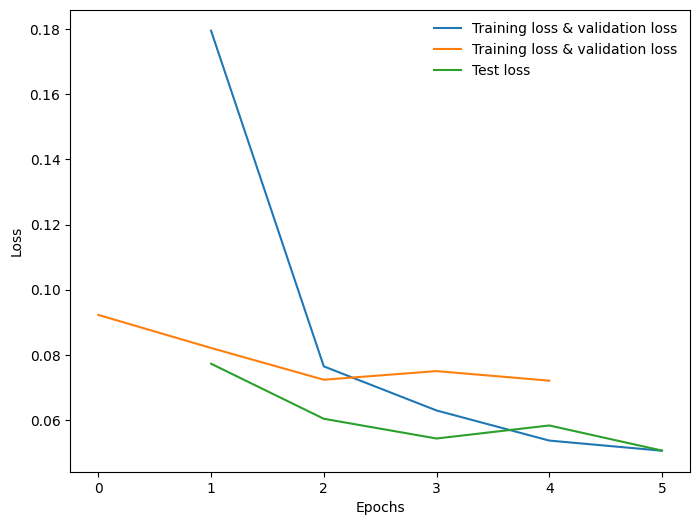

# Convolutional Neural Network (CNN) — PyTorch, MNIST

A CNN built from scratch for handwritten digit classification on the MNIST dataset, developed on Google Colab.

## Overview

Designed and implemented a CNN architecture from scratch for image classification, leveraging convolution, pooling, and non-linear activations. Built an end-to-end training pipeline including preprocessing, loss optimization (CrossEntropyLoss + Adam), and performance evaluation across train, validation, and test sets.
## Model Architecture

| Layer | Details                                 |
| ----- | --------------------------------------- |
| Conv1 | 1 → 16 filters, 3×3, ReLU, MaxPool 2×2  |
| Conv2 | 16 → 32 filters, 3×3, ReLU, MaxPool 2×2 |
| FC1   | 32×7×7 → 10, ReLU                       |
## Dataset

- **Dataset:** MNIST
- **Train set:** 48,000 images
- **Validation set:** 12,000 images (split from original 60,000 training images)
- **Test set:** 10,000 images
- **Preprocessing:** Normalize with mean=0.5, std=0.5

---

## Training

| Parameter     | Value            |
| ------------- | ---------------- |
| Epochs        | 5                |
| Batch size    | 100              |
| Learning rate | 0.01             |
| Optimizer     | Adam             |
| Loss          | CrossEntropyLoss |

No random seed is set — results are non-deterministic across runs.
## Results

| Metric        | Approximate Value |
| ------------- | ----------------- |
| Val Accuracy  | ~99%              |
| Test Accuracy | ~98%              |

## Environment

Google Colab (T4 GPU) · PyTorch · torchvision · April 2025

## Future Work

- Fix a random seed (torch.manual_seed, NumPy, Python random, cudnn deterministic) for reproducible experiments.
- Add learning rate scheduling and early stopping.
- Experiment with data augmentation to improve robustness.
